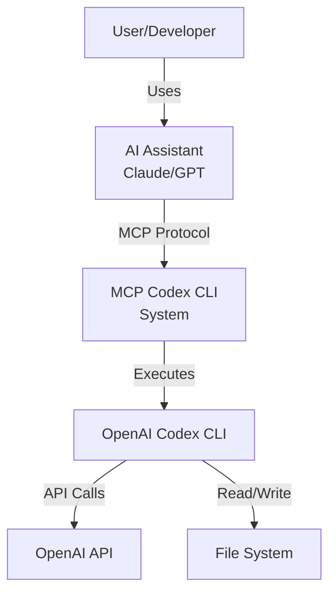
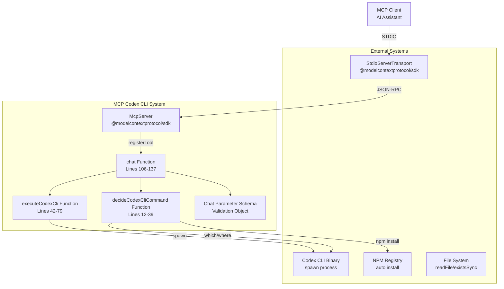
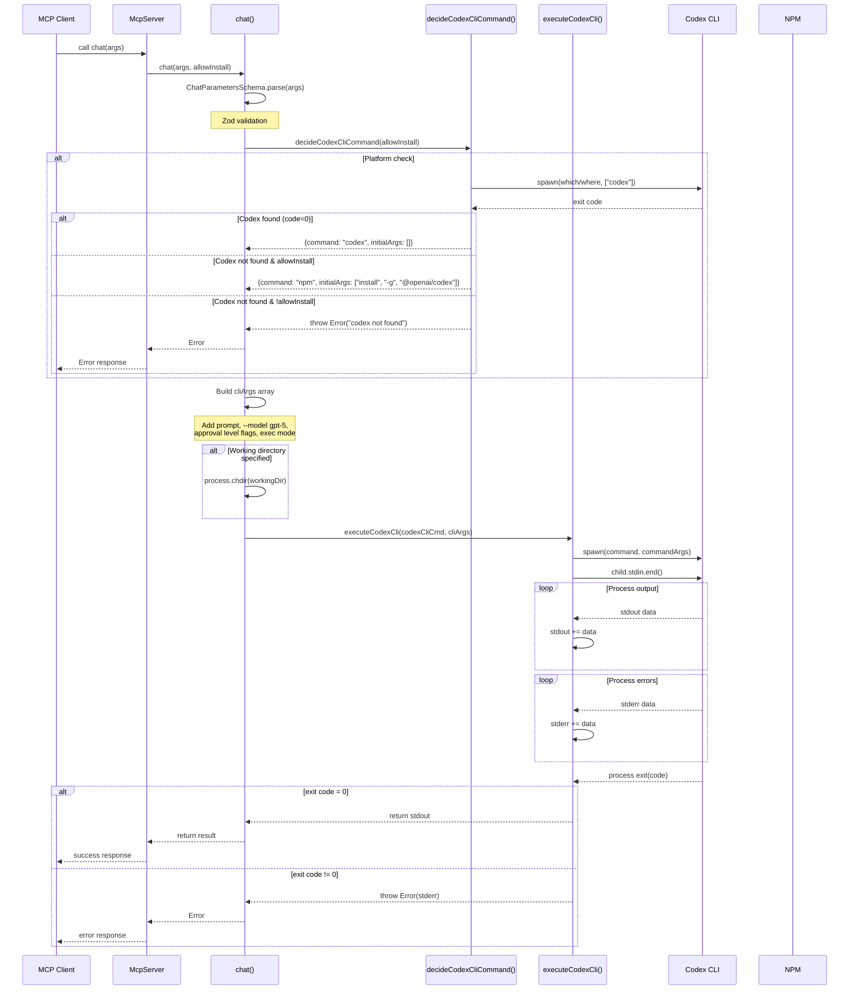
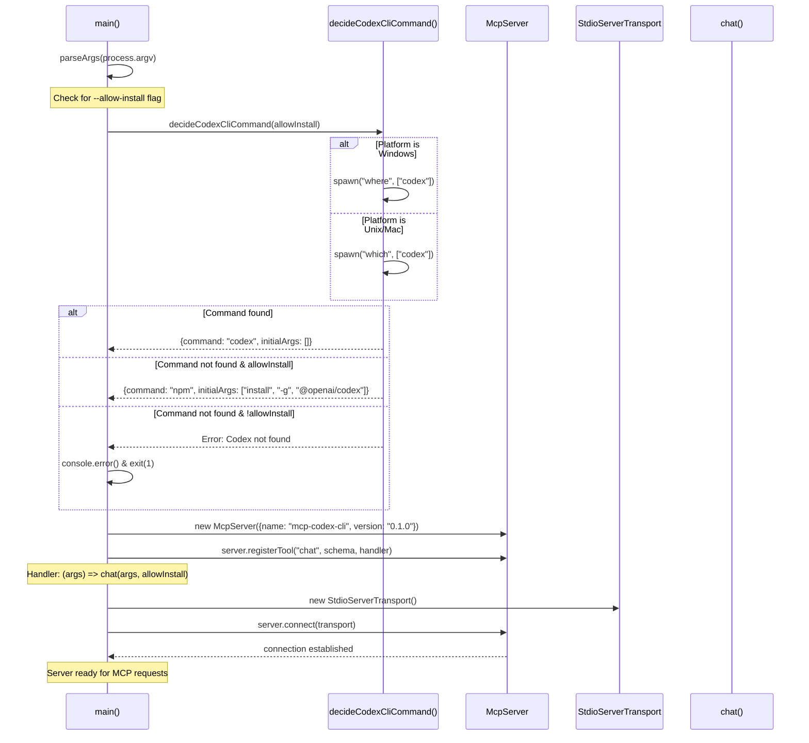

# MCP Codex CLI アーキテクチャ設計 (C4 Model)

## 1. システムコンテキスト図



### システムコンテキスト図の構成要素

| 要素                 | 説明                                                         |
| -------------------- | ------------------------------------------------------------ |
| User/Developer       | コード生成・分析・デバッグを行いたい開発者                   |
| AI Assistant         | MCPクライアントとして動作するAIアシスタント（Claude, GPT等） |
| MCP Codex CLI System | OpenAI Codex CLIをMCPツールとして公開するラッパーシステム    |
| OpenAI Codex CLI     | OpenAIの公式コーディングエージェントCLIツール                |
| OpenAI API           | GPTモデルにアクセスするためのOpenAI APIサービス              |
| File System          | コード生成・修正対象のローカルファイルシステム               |

## 2. コンテナ図



### コンテナ図の構成要素

| 要素                    | 説明                                                 |
| ----------------------- | ---------------------------------------------------- |
| McpServer               | `@modelcontextprotocol/sdk`のMCPサーバーインスタンス |
| chat()                  | コーディングタスク実行関数（106-137行）              |
| decideCodexCliCommand() | Codex CLI検出・判定関数（12-39行）                   |
| executeCodexCli()       | Codex CLI実行関数（42-79行）                         |
| Chat Parameter Schema   | chatツール用パラメータ検証スキーマ（82-100行）       |
| StdioServerTransport    | 標準入出力によるMCP通信トランスポート                |
| Codex CLI Binary        | `spawn()`で実行されるCodex CLI実行ファイル           |
| NPM Registry            | `--allow-install`時のCodex CLI自動インストール       |

## 3. コンポーネント図（シーケンス図）

### 3.1 chat ツールの実行フロー



### 3.2 初期化フロー



## 4. 実装詳細

### 4.1 技術仕様

| 項目       | 詳細                              |
| ---------- | --------------------------------- |
| Runtime    | Node.js 22+ （Codex CLI要件）     |
| Language   | TypeScript （ES2022ターゲット）   |
| MCP SDK    | @modelcontextprotocol/sdk ^1.13.1 |
| Validation | Zod ^3.25.67                      |
| Linting    | Biome ^2.0.5                      |
| Testing    | Node.js Built-in Test Runner      |

### 4.2 ファイル構造

```
mcp-codex-cli/
├── index.ts                    # メイン実装（MCP Server + Tools）
├── dist/                      # ビルド出力
│   ├── index.js              # 実行可能ファイル（shebang付き）
│   ├── index.d.ts            # TypeScript型定義
│   └── index.js.map          # ソースマップ
├── tests/
│   ├── unit/
│   │   └── schemas.test.ts   # Zodスキーマ検証テスト
│   └── integration/
│       └── tools.test.ts     # 統合テスト（Node.js内蔵テストランナー）
├── package.json              # プロジェクト設定・依存関係
├── tsconfig.json            # TypeScript設定
├── biome.json              # Linting・Formatting設定
├── CLAUDE.md               # Claude Code用ガイダンス
├── ARCHITECTURE.md         # アーキテクチャ設計書（このファイル）
├── DEVELOPMENT.md          # 開発環境・テストガイド
└── README.md               # プロジェクト概要（日本語メイン）
```

### 4.3 コード構造詳細

#### index.ts

- 依存関係とデフォルト設定
- CLI検出・実行管理
- Zodによるパラメータ検証
- chatツールの実装
- サーバー初期化・ツール登録

#### ツールの実装詳細

**chat**
- プロンプト処理、承認レベル制御（auto-edit/full-auto）
- 常にexecモードで非インタラクティブ実行
- 作業ディレクトリ変更 (`process.chdir()`)
- Codex CLIのコマンドライン引数構築
- あらゆるコーディングタスクに対応（生成、解析、デバッグ、リファクタリング）
